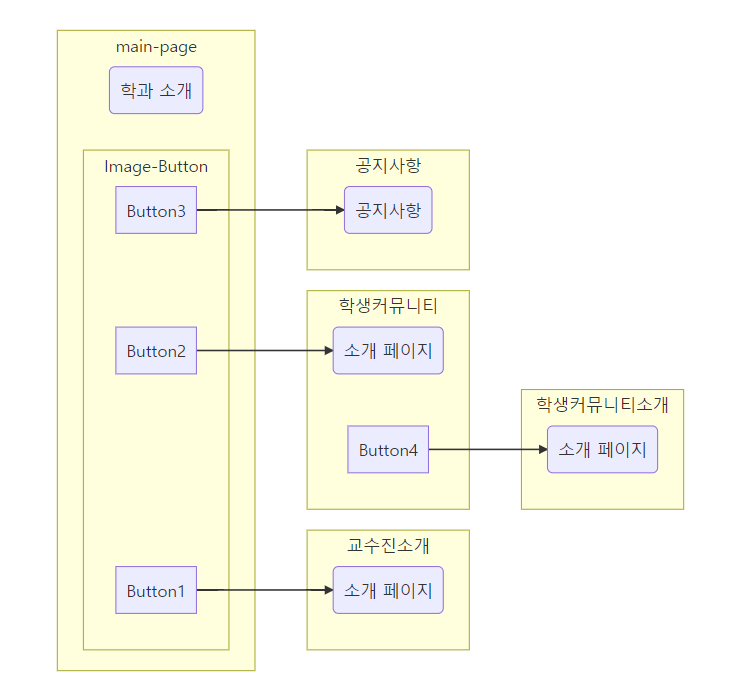

## 모바일 프로그래밍

1. 2021-11-12 실행이 완료된 페이지 업로드
   1. 옵션 메뉴를 이용한 홈으로 이동
   2. 각 액티비티를 오갈 수 있는 버튼

### 요구사항

본인이 소속된 학과 (부경대학교 IT융합응용공학과, 의공학과, 등등) 를 소개하는 앱을 만들어 봅시다.

각학과별로 내용은 다를수 있으니 본인이 속한 학과 위주로 생각해서 만들어 보세요. 내용에 대해 정해진 것은 없습니다.

앱을 구성하는 각 화면(페이지) 간의 이동은 매 화면(액티비티)마다 동일하게 제공하는 버튼(이전, 다음)을 클릭하여 이동하고,

홈으로 돌아가기는 옵션 메뉴를 이용하여 소개앱의 맨 첫페이지로 돌아가기를 구현하는 방식 입니다.

1. 첫화면 (홈, 초기 액티비티)

   - 학과 소개 (본인이 생각하는 IT융합응용공학과 혹은 의공학과)
   - 이미지버튼 3개 :
     - 교수진 소개
     - 학생 community 소개
     - 공지사항

2. 교수진소개화면 (2번째 액티비티)

   - 김영봉 교수 및 본인이 소개하고자 하는 여러 교수님들에 대한 소개 페이지 만들기

3. 학생 community 화면 (3번째 액티비티)

   - 본인이 소속되어 있거나 관심 있는 임의의 학생 커뮤니티를 소개하는 페이지

   - 버튼 1개(다음) : 커뮤니티소속학생에 대한 소개 페이지

4. 학생comminity 소속학생 소개 화면 (4번째 액티비티)

   - 본인의 이름을 포함한 소개 페이지 작성

   - 3번째 액티비티의 하위 액티비티임.

5. 공지사항 화면 (5번째 액티비티)

   - 학과 홈페이지에 가장 최근에 올라온 내용으로 공지사항 만들기

</img>

